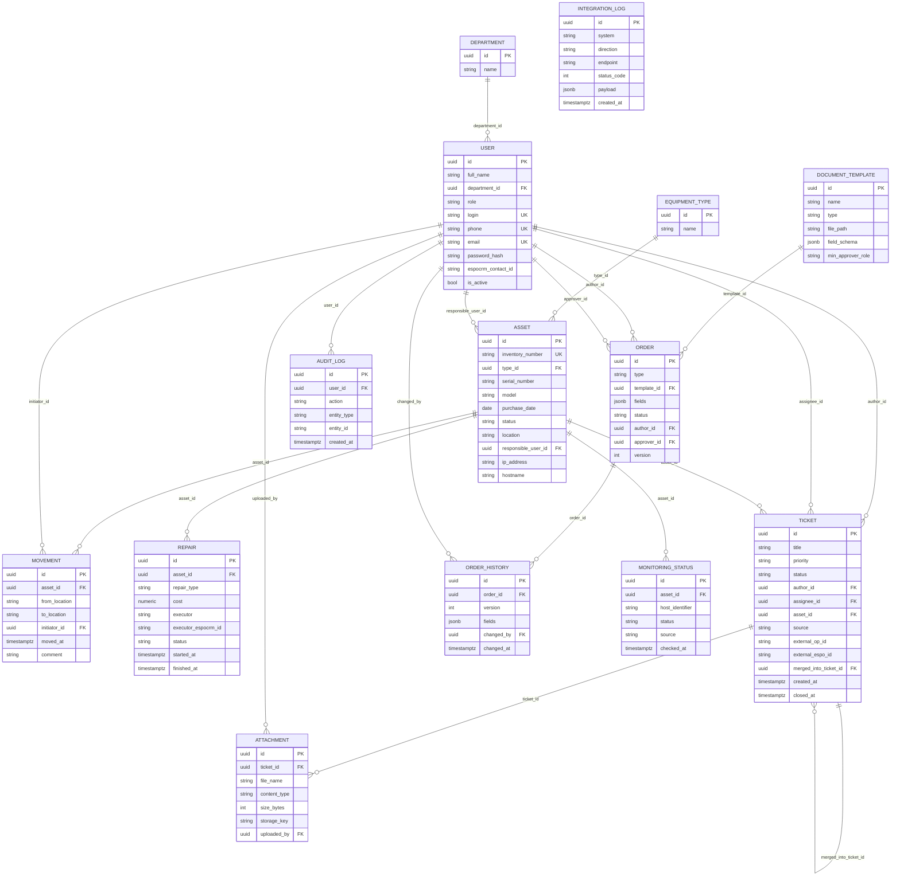

# Схема базы данных

Актуально на сессию **B02** (миграции `c8ee68f1a13f` + `564fc4e19487`).

## ER-диаграмма

## Таблицы

| Таблица | Назначение | Сессия |
|---|---|---|
| `department` | Справочник подразделений | B01 |
| `equipment_type` | Справочник типов оборудования | B01 |
| `user` | Пользователи системы | B01 |
| `asset` | Единицы оборудования (инвентаризация) | B01 |
| `movement` | История перемещений оборудования | B02 |
| `repair` | Учёт ремонтов | B02 |
| `ticket` | Заявки (инциденты/запросы) | B02 |
| `attachment` | Вложения к заявкам (MinIO), сверх ТЗ | B02 |
| `document_template` | Шаблоны документов ОРД | B02 |
| `order` | Заявки на согласование документов ОРД | B02 |
| `order_history` | История версий Order | B02 |
| `monitoring_status` | Текущий статус мониторинга хоста (Zabbix/Kaspersky) | B02 |
| `integration_log` | Журнал запросов к внешним системам | B02 |
| `audit_log` | Журнал аудита действий пользователей | B02 |

## Известные технические детали / договорённости

- `document_template.type` (тип `document_template_type`) переиспользуется в `order.type` — один и тот же enum-тип Postgres на две таблицы.
- `document_template.min_approver_role` переиспользует `user_role` (тот же enum-тип, что и `user.role`), а не заводит отдельный.
- Все Postgres enum-типы, кроме `user_role` и `asset_status` (принадлежат миграции `c8ee68f1a13f`, B01), удаляются вручную в `downgrade()` миграции `564fc4e19487` — `op.drop_table()` сам их не удаляет.
- `attachment` — сущность сверх базового ТЗ, введена под хранение вложений к заявкам через MinIO (сессия B10a).