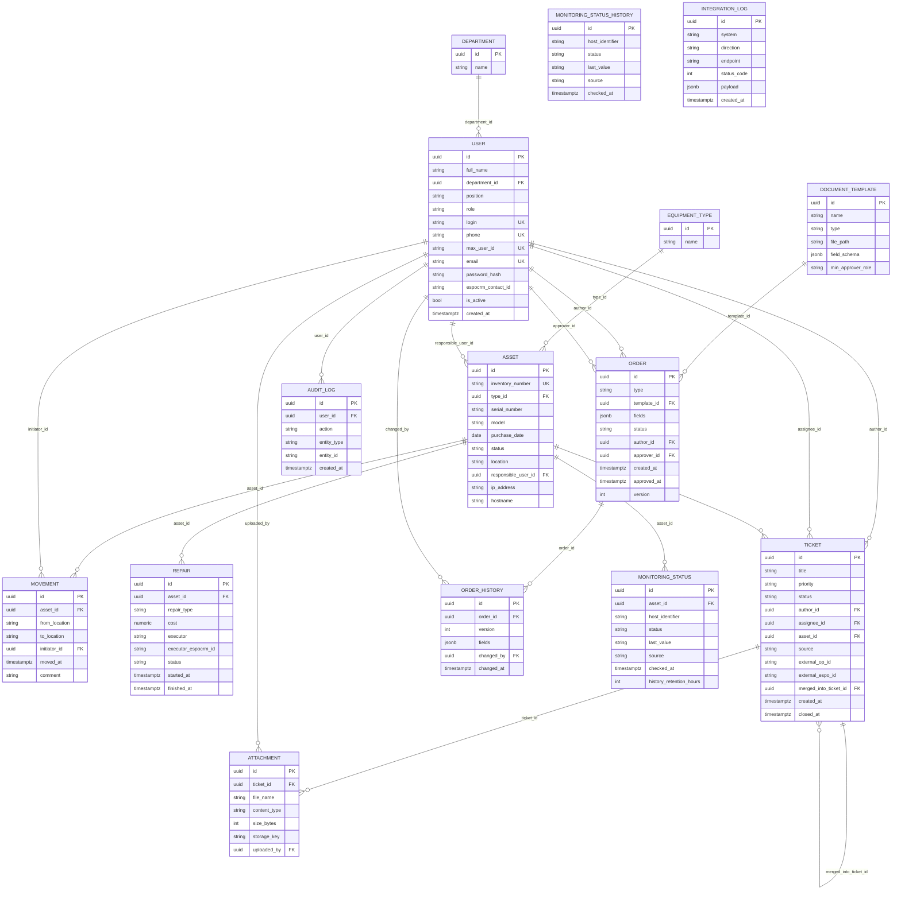

# Схема базы данных

Актуально на сессию **B16** (миграции `c8ee68f1a13f` + `564fc4e19487` + `d9c574f44d1f` + `e8cff9f59e6b`).

## ER-диаграмма

## Таблицы

| Таблица | Назначение | Сессия |
|---|---|---|
| `department` | Справочник подразделений | B01 |
| `equipment_type` | Справочник типов оборудования | B01 |
| `user` | Пользователи системы | B01 (B10: `max_user_id`, nullable-поля) |
| `asset` | Единицы оборудования (инвентаризация) | B01 |
| `movement` | История перемещений оборудования | B02 |
| `repair` | Учёт ремонтов | B02 |
| `ticket` | Заявки (инциденты/запросы) | B02 |
| `attachment` | Вложения к заявкам (MinIO), сверх ТЗ | B02 |
| `document_template` | Шаблоны документов ОРД | B02 |
| `order` | Заявки на согласование документов ОРД | B02 |
| `order_history` | История версий Order | B02 |
| `monitoring_status` | Текущий статус мониторинга хоста (Zabbix/Kaspersky) | B02 (B12: `history_retention_hours`) |
| `monitoring_status_history` | Append-only журнал статусов хоста (запись на каждый опрос), сверх ТЗ | B12 |
| `integration_log` | Журнал запросов к внешним системам | B02 |
| `audit_log` | Журнал аудита действий пользователей | B02 |

## Известные технические детали / договорённости

- `document_template.type` (тип `document_template_type`) переиспользуется в `order.type` — один и тот же enum-тип Postgres на две таблицы.
- `document_template.min_approver_role` переиспользует `user_role` (тот же enum-тип, что и `user.role`), а не заводит отдельный.
- Все Postgres enum-типы, кроме `user_role` и `asset_status` (принадлежат миграции `c8ee68f1a13f`, B01), удаляются вручную в `downgrade()` миграции `564fc4e19487` — `op.drop_table()` сам их не удаляет.
- `attachment` — сущность сверх базового ТЗ, введена под хранение вложений к заявкам через MinIO (сессия B10a).
- `user` (B10): `department_id`, `login`, `password_hash` — nullable, потому что у «теневых» пользователей, автоматически создаваемых по обращению из MAX, этих данных нет (без синтетических заглушек). `max_user_id` (уникальный, nullable) — основной идентификатор такого пользователя; `phone` для этого не используется, т.к. MAX его не передаёт.
- `monitoring_status_history` (B12): append-only, без внешних ключей — связь с `monitoring_status` логическая, по паре `(host_identifier, source)`. Использует те же enum-типы `monitoring_health_status` и `monitoring_source`, что и `monitoring_status` (в модели `create_type=False`). Индекс `(host_identifier, checked_at)` под выборку истории хоста за период. Глубина хранения — `settings.MONITORING_HISTORY_DEFAULT_RETENTION_HOURS` либо `monitoring_status.history_retention_hours` для конкретного хоста; очистка — периодическая Celery-задача `cleanup_monitoring_history`.
- `document_template.field_schema` — `jsonb`; на уровне приложения это упорядоченный массив описаний полей (`list[dict]`, сессия B15), а не объект. Тип столбца в БД не менялся, миграции не было.
- Сессии B14–B16 (ОРД) не меняли схему БД: миграций нет.